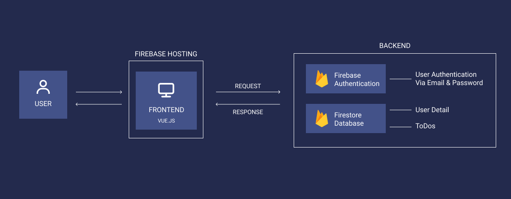

# ToDo-App Nathalie Büttner

## About this Repository 
Following functionalities are implemented:
- Authentication & Authorization with firebase
    - sign in with google
- firestore database stores data of specific user
    - real-time updates with onSnapshot() Method
- vue router

## Frameworks used
- vue.js

## Folder structure
| Folder | Description           |   |   |   |
|--------|-----------------------|---|---|---|
| pages  | vue pages             |   |   |   |
| assets | styles, images, fonts |   |   |   |
| router | vue router            |   |   |   |
|        |                       |   |   |   |

## Architectural Overview

relativer pfad


## Local Setup Instructions
```sh
npm install
```
```sh
npm run dev
```
Please note that the Google login only works live, as the domain must be authorized in Firebase.

## Live Version
https://to-do-app-53bd6.web.app